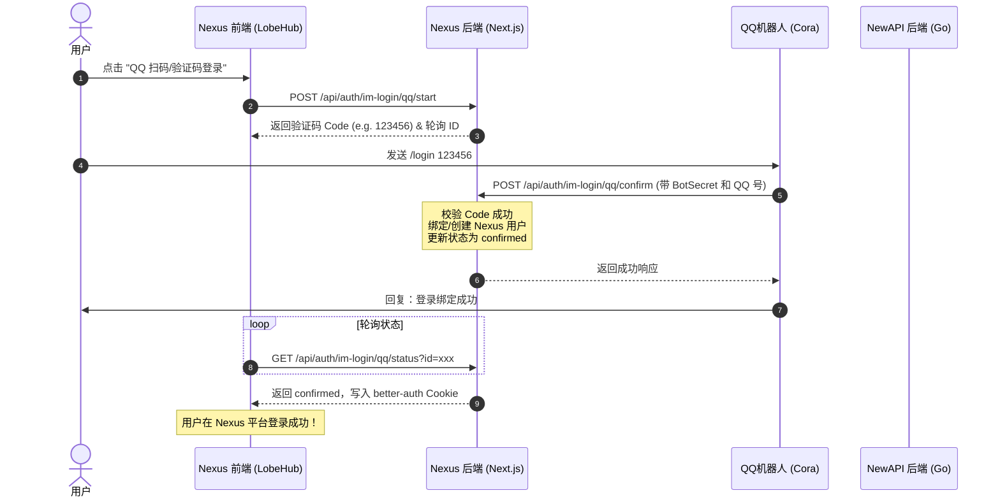

# Nexus & NewAPI 深度融合：后端架构与统一认证设计指南

> [!NOTE]
> 本文档供后端开发工程师参考，用于指导 Nexus (LobeHub) 与 NewAPI 两个系统的统一认证设计、数据库互通以及 QQ 机器人登录逻辑的融合。

---

## 1. 架构定位与职责划分

为避免账号体系分裂、重复开发及会话同步的复杂性，建议采用 **Nexus 作为唯一认证源 (Auth Provider / Single Sign-On)**，NewAPI 作为**无状态接口代理与计费引擎**的架构。

* **Nexus (Frontend/Platform)**:
  * 承载用户注册、OAuth2、QQ 机器人绑定/登录、Session 会话管理。
  * 拥有主数据库（PostgreSQL），通过 `BetterAuth` 管理 `users`、`sessions`、`nexus_im_identities` 等表。
* **NewAPI (Model Provider & Billing)**:
  * 专注于高并发的模型路由分发和额度（Quota）扣减。
  * 与 Nexus 共享 PostgreSQL 数据库（只读或部分写），或者通过内部统一的 **API Key / Token 校验** 与 Nexus 关联，消除自身的 Session Cookie 会话依赖。

---

## 2. QQ 机器人验证码登录：融合方案设计

### 现状对比
* **LobeHub (Nexus) 方案**：前端请求 `/start` 产生 6 位码放入 `nexus_im_login_codes`。QQ 机器人调用 `/confirm` 写入/绑定 `nexus_im_identities` 并创建 LobeHub 用户，前端轮询 `/status` 并自动写入 `better-auth` 的 session cookie 完成登录。
* **NewAPI 方案**：由 Go 后端生成 6 位码并记录于内存/数据库，机器人调用 `/confirm` 验证后，利用 Gin Session 会话完成 NewAPI 自身站点的登录。

### 统一融合路径：**以 Nexus (BetterAuth) 为主认证中心**

为实现“一次登录，全站打通”，推荐采用以下设计：



#### 为什么这是更优的方案？
1. **用户体验一致**：用户只需要在 Nexus 一个前端页面进行操作，登录后可以直接使用生图、对话、Agent 等所有高级功能。
2. **账号完全一致**：新注册的用户信息直接进入 Postgres 的 `users` 表，NewAPI 通过数据库视图或 API 即可直接读取其额度和余额。
3. **免去 NewAPI 的 Session 维护**：用户在使用 Nexus 聊天时，Nexus 在请求 NewAPI 时会自动携带该用户的 API Key。NewAPI 只需要做**令牌校验 (Token Auth)**，不需要维护针对用户的 Web 会话。

---

## 3. 数据库互通与额度扣减设计

由于两个系统共享一个数据库或互通，后端工程师应注意以下数据库表的设计与映射：

### A. 共享用户表
在 `packages/database/src/schemas/nexus.ts` 中，我们已经定义了 `nexus_legacy_user_mappings` 表。
```sql
CREATE TABLE nexus_legacy_user_mappings (
    id SERIAL PRIMARY KEY,
    user_id VARCHAR(255) NOT NULL,          -- Nexus 端的 User ID (UUID)
    legacy_user_id INTEGER NOT NULL,        -- NewAPI 端老用户的 ID (Int)
    created_at TIMESTAMP DEFAULT NOW()
);
```
* **用户注册/绑定时**：后端工程师应在 PostgreSQL 中建立触发器或同步逻辑，当 Nexus 端创建新用户（或通过 QQ 登录创建）时，在 NewAPI 的 `users` 表（或对应的额度表）中生成对应记录，确保 Legacy ID 和 New User ID 双向绑定。

### B. 额度同步设计 (Billing)
为了让 Nexus 上的对话计费直接扣减 NewAPI 的额度：
1. **API 调用路径**：Nexus 前端 -> Nexus 后端 (Next.js API Route) -> 携带用户专属 NewAPI Key -> NewAPI 后端 (Go) -> 扣减额度 -> 返回流。
2. **计费归属**：NewAPI 扣减该 API Key 对应用户的额度，Nexus 仅作为 UI 呈现。当用户在 Nexus 前端查询余额时，直接调用 Nexus 后端代理 of NewAPI `/api/user/info` 接口，呈现最新的可用额度。

---

## 4. 后端工程师需要实现的 API 与任务

1. **机器人 Webhook 路由迁移**：
   * 将 QQ 机器人的 `/confirm`、签到 `/checkin` 等 Webhook 接口从原 NewAPI 逐步收拢或代理到 Nexus 后端 (`/api/auth/im-login/qq/*`)，保证认证源统一。
2. **用户表迁移脚本验证**：
   * 确保 `scripts/nexus-to-betterauth/index.mts` 脚本能够兼容老用户（特别是 QQ 绑定数据）的准确迁移。
3. **API Key 自动签发逻辑**：
   * 在用户首次通过 QQ 机器人成功注册/登录 Nexus 时，Nexus 后端应自动调用 NewAPI 的创建令牌接口，为该用户自动生成一个“内置 API Key”存储在 Nexus 的用户 Meta 字段中，用于日常聊天的无感代理请求。
